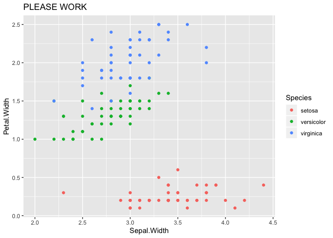

README
================
Robert West
6/8/2020

This is a line from RStudio

``` r
ggplot(data=iris, aes(x=Sepal.Width, y=Petal.Width))+
  geom_point(aes(color = Species)) +
  labs(title = "PLEASE WORK")
```

<!-- -->
