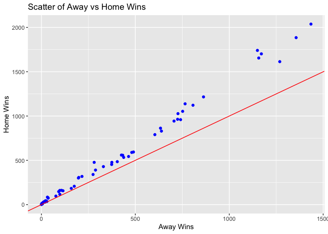
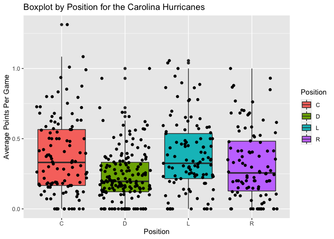
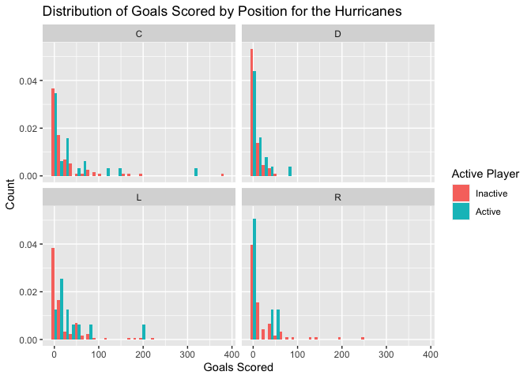
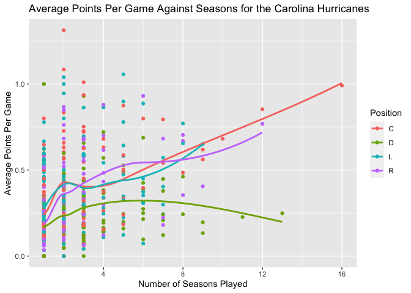
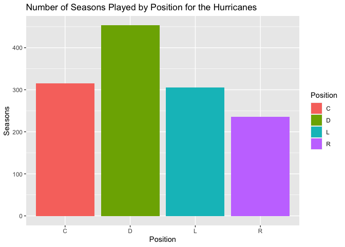

Project 1
================
Robert West
6/8/2020

# JSON Data

*Java Script Object Notation* (or JSON) is a text-based data format that
is used primarily to send and receive data from internet applications.
It is so widely used because its text structure makes it much easier to
send files. The “issue” that this can bring with it is that you need to
convert the text representation of data into an object that R (or any
other language) knows how to work with. JSON structure is nested as
shown below. 

This structure allows you to define characteristics of an object that
are also allowed to have their own characteristics. While this is
extremely flexible, it can be a little difficult to parse yourself.

# Packages for JSON files in R

Luckily, we don’t usually have to parse the data manually. There are 3
main packages in R that deal with JSON data:  
\* `rjson`  
\* `jsonlite`  
\* `rjsonio`

Most of these packages do similar things and boil down mostly to
personal preference and the needs of your project

The package that I chose to work with is the `jsonlite` package. I chose
this because it offers the functionality to return a nested list as a
data frame without parsing the data yourself.

# NHL API

To get a feel for handling JSON data, let’s communicate with an API
(Application Programming Interface) for the NHL. The URL for accessing
the API is saved below and a function for requesting Franchise
information is provided to make code more readable. In this function, I
utilize:

  - httr::GET() to access a given web address
  - httr::content() to turn the output into a text file
  - jsonlite::fromJSON() to turn the text file into a data frame(with
    flatten=TRUE)

To access more data from the API, I wrote 4 more functions
extraordinarily similar to the `get_franchises()` function but with
different URLs. Every API is different, so to determine how to request
the right information, you need to read the
[documentation](https://gitlab.com/dword4/nhlapi/-/blob/master/records-api.md).

``` r
base_url = "https://records.nhl.com/site/api"
```

``` r
get_franchises = function(){
  library(jsonlite)
  full_url = paste0(base_url, "/franchise")
  text = content(GET(url=full_url), "text") #Converts the JSON output from the API to a text file
  list_output = fromJSON(text, flatten = T)
  
  return(list_output$data)
}
```

Now that we can communicate with the API and can load the data into a
data frame, let’s explore(particularly the Hurricanes)\!

``` r
id=26 #Go 'Canes

franchises = get_franchises()
franchise_totals = get_franchise_totals()
season_records = get_season_records(id)
goalie_records = get_goalie_records(id)
skater_records = get_skater_records(id)

kable(franchises)
```

| id | firstSeasonId | fullName              | lastSeasonId | mostRecentTeamId | teamAbbrev | teamCommonName | teamPlaceName |
| -: | ------------: | :-------------------- | -----------: | ---------------: | :--------- | :------------- | :------------ |
|  1 |      19171918 | Montréal Canadiens    |           NA |                8 | MTL        | Canadiens      | Montréal      |
|  2 |      19171918 | Montreal Wanderers    |     19171918 |               41 | MWN        | Wanderers      | Montreal      |
|  3 |      19171918 | St. Louis Eagles      |     19341935 |               45 | SLE        | Eagles         | St. Louis     |
|  4 |      19191920 | Hamilton Tigers       |     19241925 |               37 | HAM        | Tigers         | Hamilton      |
|  5 |      19171918 | Toronto Maple Leafs   |           NA |               10 | TOR        | Maple Leafs    | Toronto       |
|  6 |      19241925 | Boston Bruins         |           NA |                6 | BOS        | Bruins         | Boston        |
|  7 |      19241925 | Montreal Maroons      |     19371938 |               43 | MMR        | Maroons        | Montreal      |
|  8 |      19251926 | Brooklyn Americans    |     19411942 |               51 | BRK        | Americans      | Brooklyn      |
|  9 |      19251926 | Philadelphia Quakers  |     19301931 |               39 | QUA        | Quakers        | Philadelphia  |
| 10 |      19261927 | New York Rangers      |           NA |                3 | NYR        | Rangers        | New York      |
| 11 |      19261927 | Chicago Blackhawks    |           NA |               16 | CHI        | Blackhawks     | Chicago       |
| 12 |      19261927 | Detroit Red Wings     |           NA |               17 | DET        | Red Wings      | Detroit       |
| 13 |      19671968 | Cleveland Barons      |     19771978 |               49 | CLE        | Barons         | Cleveland     |
| 14 |      19671968 | Los Angeles Kings     |           NA |               26 | LAK        | Kings          | Los Angeles   |
| 15 |      19671968 | Dallas Stars          |           NA |               25 | DAL        | Stars          | Dallas        |
| 16 |      19671968 | Philadelphia Flyers   |           NA |                4 | PHI        | Flyers         | Philadelphia  |
| 17 |      19671968 | Pittsburgh Penguins   |           NA |                5 | PIT        | Penguins       | Pittsburgh    |
| 18 |      19671968 | St. Louis Blues       |           NA |               19 | STL        | Blues          | St. Louis     |
| 19 |      19701971 | Buffalo Sabres        |           NA |                7 | BUF        | Sabres         | Buffalo       |
| 20 |      19701971 | Vancouver Canucks     |           NA |               23 | VAN        | Canucks        | Vancouver     |
| 21 |      19721973 | Calgary Flames        |           NA |               20 | CGY        | Flames         | Calgary       |
| 22 |      19721973 | New York Islanders    |           NA |                2 | NYI        | Islanders      | New York      |
| 23 |      19741975 | New Jersey Devils     |           NA |                1 | NJD        | Devils         | New Jersey    |
| 24 |      19741975 | Washington Capitals   |           NA |               15 | WSH        | Capitals       | Washington    |
| 25 |      19791980 | Edmonton Oilers       |           NA |               22 | EDM        | Oilers         | Edmonton      |
| 26 |      19791980 | Carolina Hurricanes   |           NA |               12 | CAR        | Hurricanes     | Carolina      |
| 27 |      19791980 | Colorado Avalanche    |           NA |               21 | COL        | Avalanche      | Colorado      |
| 28 |      19791980 | Arizona Coyotes       |           NA |               53 | ARI        | Coyotes        | Arizona       |
| 29 |      19911992 | San Jose Sharks       |           NA |               28 | SJS        | Sharks         | San Jose      |
| 30 |      19921993 | Ottawa Senators       |           NA |                9 | OTT        | Senators       | Ottawa        |
| 31 |      19921993 | Tampa Bay Lightning   |           NA |               14 | TBL        | Lightning      | Tampa Bay     |
| 32 |      19931994 | Anaheim Ducks         |           NA |               24 | ANA        | Ducks          | Anaheim       |
| 33 |      19931994 | Florida Panthers      |           NA |               13 | FLA        | Panthers       | Florida       |
| 34 |      19981999 | Nashville Predators   |           NA |               18 | NSH        | Predators      | Nashville     |
| 35 |      19992000 | Winnipeg Jets         |           NA |               52 | WPG        | Jets           | Winnipeg      |
| 36 |      20002001 | Columbus Blue Jackets |           NA |               29 | CBJ        | Blue Jackets   | Columbus      |
| 37 |      20002001 | Minnesota Wild        |           NA |               30 | MIN        | Wild           | Minnesota     |
| 38 |      20172018 | Vegas Golden Knights  |           NA |               54 | VGK        | Golden Knights | Vegas         |
| 39 |      20212022 | Seattle Kraken        |           NA |               55 | SEA        | Kraken         | Seattle       |

# Data Exploration

## Table Summaries

A basic count of Position for the Hurricanes by Activity

``` r
skater_records$activePlayer = as.factor(skater_records$activePlayer)
levels(skater_records$activePlayer) = c("Inactive", "Active")

kable(table(skater_records$activePlayer, skater_records$positionCode))
```

|          |  C |   D |  L |  R |
| :------- | -: | --: | -: | -: |
| Inactive | 89 | 148 | 97 | 92 |
| Active   | 24 |  19 | 12 |  6 |

Below is a numeric summary of Rookie points for the Carolina Hurricanes
by position. This suggests that the Left Position slightly out-performs
other offensive positions in terms of rookie points

``` r
table = skater_records %>%
  group_by(positionCode)%>%
  summarize(
    count = n(),
    min = min(rookiePoints, na.rm = T),
    max = max(rookiePoints, na.rm = T), 
    mean = mean(rookiePoints, na.rm = T),
    median = median(rookiePoints, na.rm = T),
    sd = sd(rookiePoints, na.rm = T)
  )
kable(table, caption = "Numeric Summaries of Carlina Hurricanes Rookie Points by Position")
```

| positionCode | count | min | max |      mean | median |        sd |
| :----------- | ----: | --: | --: | --------: | -----: | --------: |
| C            |   113 |   0 |  68 | 12.846154 |    4.5 | 15.910762 |
| D            |   167 |   0 |  35 |  7.171875 |    4.0 |  8.399839 |
| L            |   109 |   0 |  72 | 12.549020 |    8.0 | 15.756032 |
| R            |    98 |   0 |  59 | 11.060606 |    3.0 | 15.495845 |

Numeric Summaries of Carlina Hurricanes Rookie Points by Position

## Graphical Summaries

The idea of a home field advantage is heavily debated in sports. As
shown below, it is clear that nearly every team has more home wins than
they do road wins since seemingly all points lie above the line `y=x`
This certainly doesn’t prove that a home field advantage is real, but it
might reinforce our belief in
one.

``` r
ggplot(data=franchise_totals %>% filter(gameTypeId==2), aes(y=homeWins, x=roadWins))+
  geom_point(color="blue")+
  geom_abline(slope=1, intercept = 0, color="red")+
  labs(x="Away Wins", y="Home Wins", title="Scatter of Away vs Home Wins")
```

<!-- -->

As shown below, it would seem that the Carolina Hurricanes tend to have
slightly higher scoring players in Center and Left position than right
or
defense.

``` r
skater_records$avgPointsPerGame = skater_records$points / skater_records$gamesPlayed

ggplot(data=skater_records%>%filter(gameTypeId==2), aes(x=positionCode, y=avgPointsPerGame))+
  geom_boxplot(aes(fill=positionCode))+
  geom_jitter()+
  labs(x="Position", y="Average Points Per Game", fill="Position", title = "Boxplot by Position for the Carolina Hurricanes")
```

<!-- -->

Below are the distributions of individual goals by Position and colored
with an active player indicator for the Hurricanes. While this plot
isn’t necessarily that informative, it does suggest that (as expected)
Defensive players tend to score fewer points than others.

``` r
ggplot(data=skater_records, aes(x=goals, y=..density..))+
  geom_histogram(aes(fill=activePlayer), position = "dodge")+
  facet_wrap(~positionCode)+
  labs(x="Goals Scored", y="Count", title = "Distribution of Goals Scored by Position for the Hurricanes", fill="Active Player")
```

<!-- -->

A scatter plot of Seasons Played against Average Points Per Game colored
by position suggests that there have been some very high-scoring Centers
that have long careers for the Hurricanes. While the trendlines don’t
add much predictive power where most of the data is, they do add the
visual effect of seeing which position scores more points per game on
average where the data is more dense.

``` r
ggplot(data = skater_records, aes(x=seasons, y=avgPointsPerGame))+
  geom_point(aes(color=positionCode))+
  geom_smooth(aes(color=positionCode), se=F)+
  labs(y="Average Points Per Game", x="Number of Seasons Played", color="Position", title="Average Points Per Game Against Seasons for the Carolina Hurricanes")
```

<!-- -->

A bar plot of the number of the total number of seasons played by a
position suggests that Defensive players tend to play longer for the
Hurricanes.

``` r
ggplot(data=skater_records, aes(x=positionCode, y=seasons))+
  geom_bar(stat = "identity", aes(fill=positionCode))+
  labs(x="Position", y="Seasons", fill="Position", title="Number of Seasons Played by Position for the Hurricanes")
```

<!-- -->
