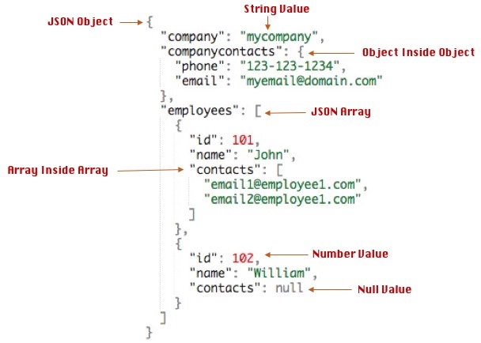

Project 1
================
Robert West
6/8/2020

# Describe JSON data. What is it, where does it get used, and why is it a good way to store data? This should be detailed enough that someone that hasn’t seen JSON data would have a good idea what they are dealing with. You should link to references where applicable.

*Java Script Object Notation* (or JSON) is a text-based data format that
is used primarily to send and receive data from internet applications.
It is so widely used because its text structure makes it much easier to
send files. The “issue” that this can bring with it is that you need to
convert the text representation of data into an object that R (or any
other language) knows how to work with. JSON structure is nested as
shown below. <!-- -->

This structure allows you to define characteristics of an object that
are also allowed to have their own characteristics. While this is
extremely flexible, it can be a little difficult to parse yourself.

# Packages for JSON files in R

Luckily, we don’t usually have to parse the data

The package that I chose to work with is the `jsonlite` package. I chose
this because it offers the functionality to return a nested list as a
data frame without parsing the data yourself.

To get a feel for handling JSON data, let’s communicate with an API
(Application Programming Interface) for the NHL. The URL for accessing
the API is saved below and a function for requesting Franchise
information is provided to make code more readable. In this function, I
utilize:

  - httr::GET() to access a given web address
  - httr::content() to turn the output into a text file
  - jsonlite::fromJSON() to turn the text file into a data frame(with
    flatten=TRUE)

To access more data from the API, I wrote 4 more functions
extraordinarily similar to the `get_franchises()` function but with
different URLs. Every API is different, so to determine how to request
the right information, you need to read the
[documentation](https://gitlab.com/dword4/nhlapi/-/blob/master/records-api.md).

``` r
base_url = "https://records.nhl.com/site/api"
```

``` r
get_franchises = function(){
  library(jsonlite)
  full_url = paste0(base_url, "/franchise")
  text = content(GET(url=full_url), "text") #Converts the JSON output from the API to a text file
  list_output = fromJSON(text, flatten = T)
  
  return(list_output$data)
}
```

Now that we can communicate with the API and can load the data into a
data frame, let’s explore\!

``` r
id=26 #Go Canes

franchises = get_franchises()
franchise_totals = get_franchise_totals()
season_records = get_season_records(id)
goalie_records = get_goalie_records(id)
skater_records = get_skater_records(id)

kable(franchises)
```

| id | firstSeasonId | lastSeasonId | mostRecentTeamId | teamCommonName | teamPlaceName |
| -: | ------------: | -----------: | ---------------: | :------------- | :------------ |
|  1 |      19171918 |           NA |                8 | Canadiens      | Montréal      |
|  2 |      19171918 |     19171918 |               41 | Wanderers      | Montreal      |
|  3 |      19171918 |     19341935 |               45 | Eagles         | St. Louis     |
|  4 |      19191920 |     19241925 |               37 | Tigers         | Hamilton      |
|  5 |      19171918 |           NA |               10 | Maple Leafs    | Toronto       |
|  6 |      19241925 |           NA |                6 | Bruins         | Boston        |
|  7 |      19241925 |     19371938 |               43 | Maroons        | Montreal      |
|  8 |      19251926 |     19411942 |               51 | Americans      | Brooklyn      |
|  9 |      19251926 |     19301931 |               39 | Quakers        | Philadelphia  |
| 10 |      19261927 |           NA |                3 | Rangers        | New York      |
| 11 |      19261927 |           NA |               16 | Blackhawks     | Chicago       |
| 12 |      19261927 |           NA |               17 | Red Wings      | Detroit       |
| 13 |      19671968 |     19771978 |               49 | Barons         | Cleveland     |
| 14 |      19671968 |           NA |               26 | Kings          | Los Angeles   |
| 15 |      19671968 |           NA |               25 | Stars          | Dallas        |
| 16 |      19671968 |           NA |                4 | Flyers         | Philadelphia  |
| 17 |      19671968 |           NA |                5 | Penguins       | Pittsburgh    |
| 18 |      19671968 |           NA |               19 | Blues          | St. Louis     |
| 19 |      19701971 |           NA |                7 | Sabres         | Buffalo       |
| 20 |      19701971 |           NA |               23 | Canucks        | Vancouver     |
| 21 |      19721973 |           NA |               20 | Flames         | Calgary       |
| 22 |      19721973 |           NA |                2 | Islanders      | New York      |
| 23 |      19741975 |           NA |                1 | Devils         | New Jersey    |
| 24 |      19741975 |           NA |               15 | Capitals       | Washington    |
| 25 |      19791980 |           NA |               22 | Oilers         | Edmonton      |
| 26 |      19791980 |           NA |               12 | Hurricanes     | Carolina      |
| 27 |      19791980 |           NA |               21 | Avalanche      | Colorado      |
| 28 |      19791980 |           NA |               53 | Coyotes        | Arizona       |
| 29 |      19911992 |           NA |               28 | Sharks         | San Jose      |
| 30 |      19921993 |           NA |                9 | Senators       | Ottawa        |
| 31 |      19921993 |           NA |               14 | Lightning      | Tampa Bay     |
| 32 |      19931994 |           NA |               24 | Ducks          | Anaheim       |
| 33 |      19931994 |           NA |               13 | Panthers       | Florida       |
| 34 |      19981999 |           NA |               18 | Predators      | Nashville     |
| 35 |      19992000 |           NA |               52 | Jets           | Winnipeg      |
| 36 |      20002001 |           NA |               29 | Blue Jackets   | Columbus      |
| 37 |      20002001 |           NA |               30 | Wild           | Minnesota     |
| 38 |      20172018 |           NA |               54 | Golden Knights | Vegas         |

<!-- --><!-- --><!-- --><!-- -->

Avg goals per game per team top scorers for each team top penalty-ers
Assists goalie saves vs attempts
